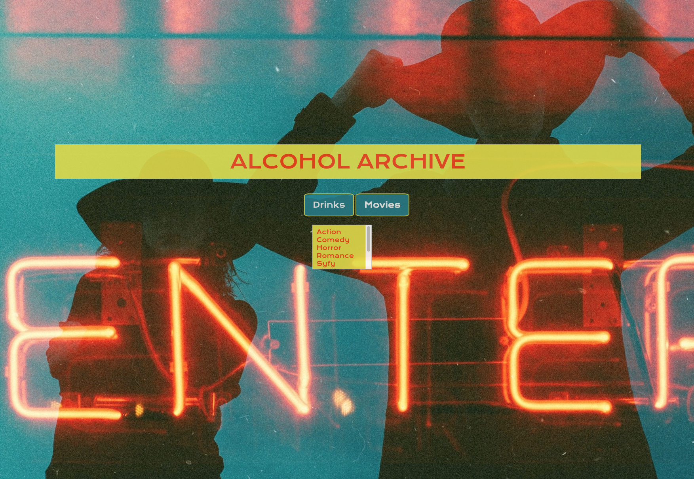
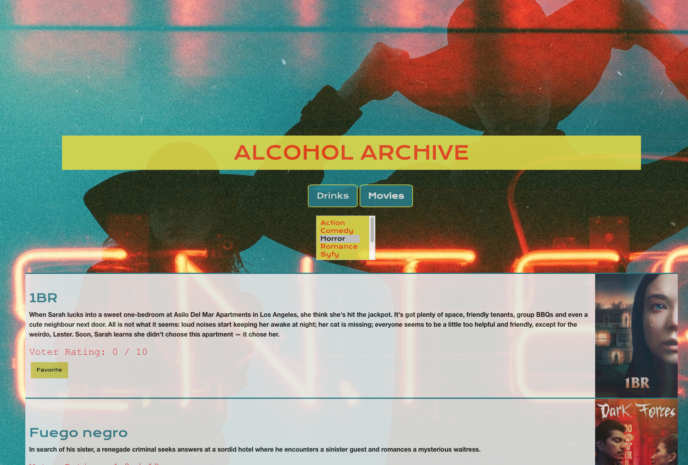
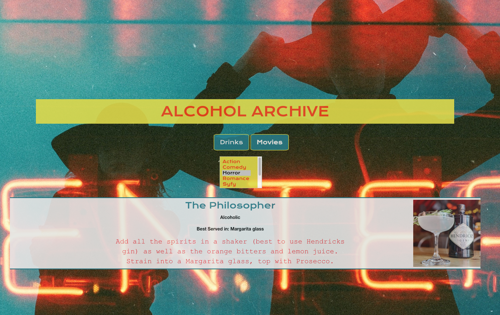

# Alcohol Archives

DEPLOYED: https://sterlingorth.github.io/Alcohol_Archives/
REPO: https://github.com/SterlingOrth/Movie_Time.git

We provide a solution to those date night lulls. We answer the questions
“What do you want to watch?” and “What can I get you to drink”.

Quit with the back and fourth of “whatever you want is fine” and “no I’m not really into it”.

2 clicks away from good entertainment and delicious drinks.

# User Story

A website which generates movies with a description and rating based on a genre, as well as a beverage to match, to assist the indecisive, alcohol-loving (or not) moviegoer.

One can spend hours on end trying to find the perfect movie for a date, hangout with friends, or just for themselves, so this was created to make the process a little less stressful and a lot more fun.

# API's

Movie API - The Movie DB
URL: https://developers.themoviedb.org/3/getting-started/introduction
URL: https://api.themoviedb.org/3/movie/76341?api_key=

Drink API - The Cocktail DB
URL: https://www.thecocktaildb.com/api.php
URL: https://www.thecocktaildb.com/api/json/v1/1/random.php

# CSS

Foundation & ASP.net

All team members agree that BOOTSTRAP is the superior CSS Framework

# Technologies

Vanilla Javascript, our group decided that this was a more popular request amongst employers. Therefore we decided to write the entire program using ONLY Javascript, even though jQuery would maybe have saved some lines of code.

The drink.js and movie.js mirror each other for the dynamic creation of elements as well as the appending of those elements.

Fetch is used to grab the data/results requested by the API.

# Github

Multiple branches were created as we collaboratively made adjustments to HTML. CSS. JS. and README.

# Screenshots

